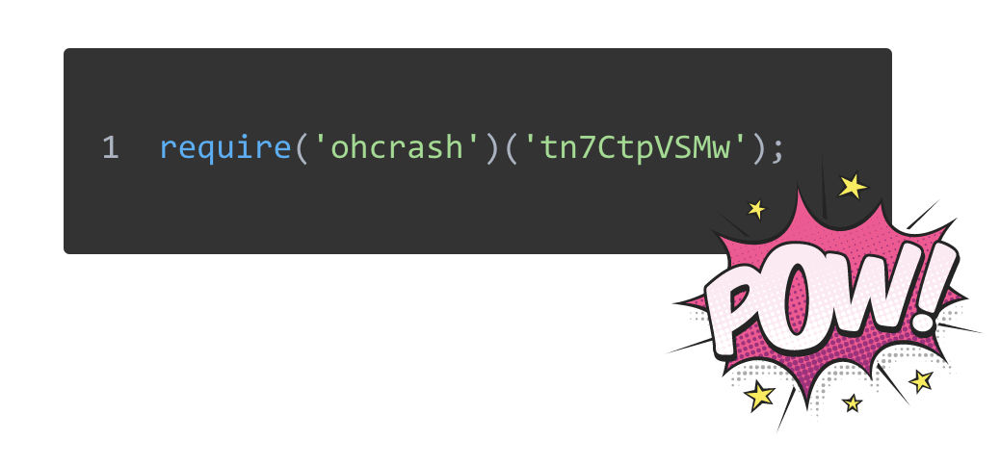
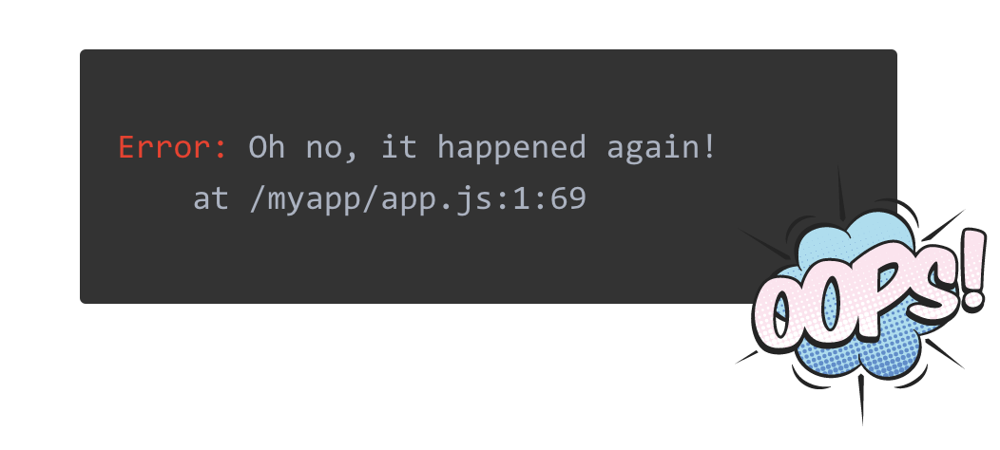
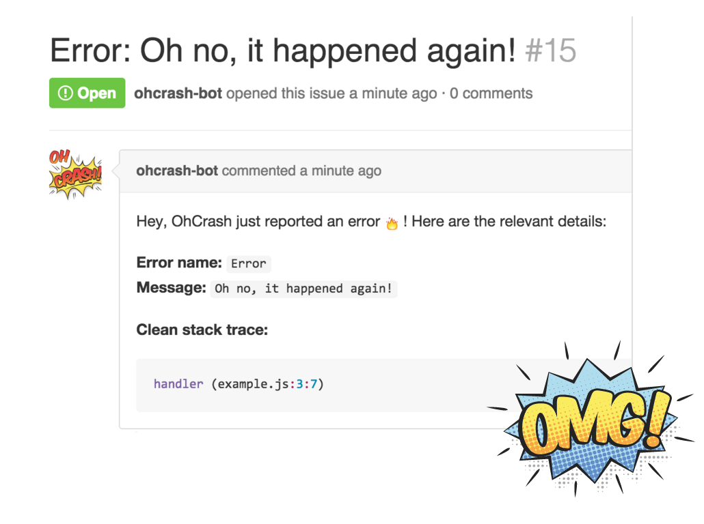

# OhCrash

<h1 align="center">
	<br>
	
	<br>
	<br>
	<br>
</h1>

### Fix errors before your users even notice them

[OhCrash](https://ohcrash.com) catches JavaScript errors and instantly opens nicely formed issues in the GitHub repository of your choice.


## How it works?

### 1. Set up OhCrash

Install ohcrash module via npm and initialize it using your API key.




### 2. Errors raised

Failures happen, there's no 100% protection for that.
But OhCrash helps you spot these errors by catching and reporting them.




### 3. Fix issues

As soon as error is caught, a new issue on GitHub will be opened will all related information (which you can customize).




## What is this repository for?

This repository contains a front-end web application, that you use over at https://ohcrash.com.
Feel free to contribute ideas/feedback/changes or improvements.


## Getting started

Below are the key commands you need to use to bundle & test this project.

Build both scripts and stylesheets:

```
$ npm run build
```

Build only scripts:

```
$ npm run scripts
```

Build only stylesheets:

```
$ npm run styles
```

Start a server:

```
$ npm start
```

Code style checking with XO is temporarily disabled.


## Tests

```
$ npm test
```


## License

MIT © [Vadim Demedes](https://github.com/vdemedes)
